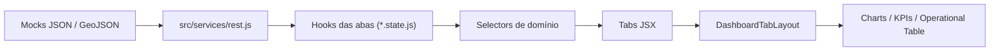
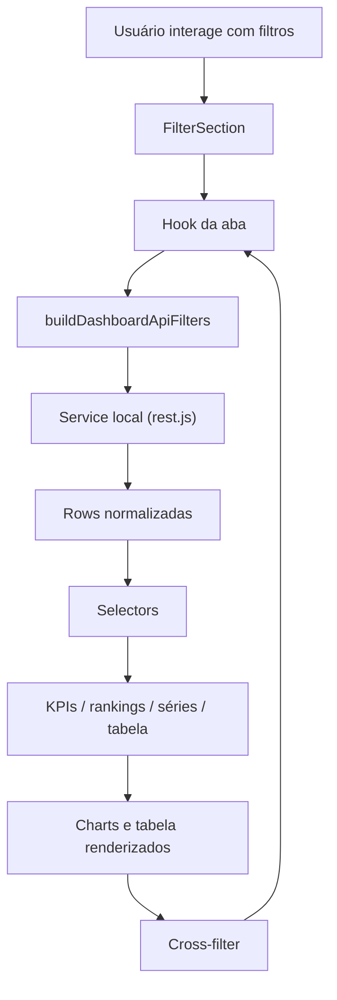
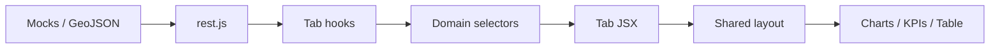

# BI Dashboard Platform

[PT-BR](#pt-br) | [English](#english)

---

## PT-BR

### Visão geral

Este projeto é um case de produto em BI construído a partir de um módulo analítico criado para ambiente corporativo e adaptado para funcionar como uma plataforma standalone de portfólio.

O foco aqui não é “simular uma tela”, mas demonstrar uma arquitetura real de dashboard analítico com:

- múltiplas abas de negócio;
- camada de serviços mockados com contrato consistente;
- filtros combináveis e cross-filter entre gráficos;
- visual corporativo moderno com tema claro e escuro;
- componentes reutilizáveis para visualização, KPIs e tabela operacional;
- base pronta para evolução futura como produto de BI.

---

### Demo do produto

O dashboard atual possui:

- `Visão Geral`
- `Produtos`
- `Clientes`
- `Fornecedores`
- `Cotações`
- `Pedidos & Logística`

Com recursos já implementados:

- tema claro/escuro com persistência;
- tabela operacional com exportação;
- mapa do Brasil com modo `map + ranking`;
- tooltips responsivos compartilhados;
- gráficos com cross-filter;
- `Heatmap`, `Stacked Bar`, `Scatter + Aggregate`, `Treemap`, `Pie`, `Line`, `Bar`, `Map Morph`;
- curvas `ABC`, `XYZ` e matriz `ABC-XYZ` nas abas analíticas principais.

---

### Stack

| Categoria | Tecnologias |
|---|---|
| Runtime | React 18, React DOM 18 |
| Build | Vite 6 |
| UI | React Bootstrap, Bootstrap 5 |
| Charts | ECharts, echarts-for-react |
| Ícones | react-icons |
| Data picker | react-datepicker, date-fns |
| i18n | i18next, react-i18next |
| Exportação | xlsx, jspdf, jspdf-autotable |
| Estilos | CSS por feature + SCSS em componentes específicos |

---

### Como rodar

#### Requisitos

- Node.js 18+
- npm

#### Instalação

```bash
npm install
```

#### Desenvolvimento

```bash
npm run dev
```

#### Build

```bash
npm run build
```

#### Preview

```bash
npm run preview
```

---

### Arquitetura aplicada

O projeto segue uma arquitetura em camadas para separar:

- contrato de dados;
- transformação e normalização;
- regras analíticas;
- estado por aba;
- composição visual;
- componentes compartilhados.

#### Fluxo principal



#### Fluxo de interação



#### Camadas

| Camada | Responsabilidade |
|---|---|
| `src/services` | Simular APIs, aplicar filtros, normalizar responses |
| `src/dashboard/selectors` | Derivar KPIs, rankings, curvas, matrizes e séries |
| `src/dashboard/hooks` | Padronizar filtros, reset, cross-filter e estado de UI |
| `src/dashboard/tabs/*/*.state.js` | Orquestrar cada domínio |
| `src/dashboard/tabs/*/*.jsx` | Compor visualmente cada aba |
| `src/dashboard/components` | Seções reutilizáveis do dashboard |
| `src/dashboard/components/shared` | Charts, tabela, cards e blocos reutilizáveis |

---

### Estrutura do projeto

```text
dashboard/
├─ package.json
├─ vite.config.js
├─ README.md
├─ BLUEPRINT_BI_STANDALONE_V2.md
└─ src/
   ├─ main.jsx
   ├─ App.jsx
   ├─ i18n.js
   ├─ components/
   │  └─ ModalV2.jsx
   ├─ core/
   │  └─ auth.js
   ├─ hooks/
   │  └─ useThemeMode.js
   ├─ services/
   │  └─ rest.js
   ├─ styles/
   │  └─ app.css
   ├─ mocks/
   │  └─ dashboard/
   │     ├─ dashboardOverview.mock.json
   │     ├─ dashboardProducts.mock.json
   │     ├─ dashboardClients.mock.json
   │     ├─ dashboardSuppliers.mock.json
   │     ├─ dashboardOrders.mock.json
   │     ├─ dashboardQuotations.mock.json
   │     └─ brasil.geo.json
   └─ dashboard/
      ├─ index.jsx
      ├─ index.css
      ├─ hooks/
      ├─ selectors/
      ├─ components/
      └─ tabs/
```

---

### Mapa técnico por pasta

#### Shell standalone

| Arquivo | Papel |
|---|---|
| `src/main.jsx` | Bootstrap do app |
| `src/App.jsx` | Shell principal, hero/header e tema |
| `src/styles/app.css` | Tokens e estilos globais |
| `src/hooks/useThemeMode.js` | Tema claro/escuro com persistência |
| `src/components/ModalV2.jsx` | Modal local reutilizado pelos charts |
| `src/core/auth.js` | Stub local de autenticação |

#### Serviço de dados

| Arquivo | Papel |
|---|---|
| `src/services/rest.js` | Simula backend, normaliza linhas, aplica filtros, retorna responses por domínio |

#### Núcleo do dashboard

| Arquivo | Papel |
|---|---|
| `src/dashboard/index.jsx` | Container das abas e lazy loading |
| `src/dashboard/index.css` | Navegação entre abas e estilos globais do módulo |

#### Hooks compartilhados

| Arquivo | Papel |
|---|---|
| `dashboardTabState.helpers.js` | Contrato de filtros, clear, merge, cross-filter e mapeamento para API |
| `useDashboardTabUi.js` | Estado visual compartilhado por aba |
| `useDashboardFilters.js` | Utilidades legadas e auxiliares |
| `useFilterSectionOptions.js` | Schema dos filtros |
| `useFormatter.js` | Formatação |
| `useKpiVariation.js` | Variação de KPIs |

#### Selectors

| Arquivo | Papel |
|---|---|
| `overviewSelectors.js` | KPIs e analytics da Visão Geral |
| `productsSelectors.js` | Produtos, glosa, ABC/XYZ e rankings |
| `clientsSelectors.js` | Clientes, curvas, mapa, rankings e ticket |
| `suppliersSelectors.js` | Fornecedores, SLA, glosa, volume e classificações |
| `ordersSelectors.js` | Pedidos e logística |
| `quotationsSelectors.js` | Cotações |
| `shared/dashboardSelectors.js` | Utilidades genéricas de derivação |
| `shared/dashboardStatus.js` | Normalização de status e paleta |
| `shared/classificationSelectors.js` | Curvas `ABC`, `XYZ` e matriz `ABC-XYZ` |

#### Componentes de layout

| Arquivo | Papel |
|---|---|
| `DashboardTabLayout.jsx` | Layout padrão de uma aba |
| `DashboardDateFilterModal.jsx` | Modal de data/período |
| `SectionWrapper.jsx` | Casca colapsável de seções |
| `FilterSection.jsx` | Filtros do dashboard |
| `KpiSection.jsx` | Grid de KPIs |
| `OverviewSection.jsx` | Grid dos gráficos |
| `OperationalDataSection.jsx` | Seção da tabela operacional |

#### Charts compartilhados

| Componente | Papel |
|---|---|
| `ChartBarVertical` | Série temporal e comparativos verticais |
| `ChartHorizontal` | Rankings horizontais |
| `ChartLine` | Evolução temporal |
| `ChartPie` | Distribuição proporcional |
| `ChartTreemap` | Status, curvas e matrizes |
| `ChartHeatmap` | Sazonalidade categoria × mês |
| `ChartStackedBar` | Evolução por status logístico |
| `ChartScatterAggregate` | Dispersão `preço × volume` com agregado lateral |
| `ChartMapMorph` | Mapa do Brasil com alternância para ranking |
| `GaugeCount` | Indicadores percentuais |
| `chartTooltip.helpers.js` | Tooltip responsivo compartilhado |
| `chartTheme.js` | Tokens reativos para charts por tema |

#### Data table

| Arquivo | Papel |
|---|---|
| `shared/dataTable/DataTable.jsx` | Tabela operacional |
| `shared/dataTable/dataTable.state.js` | Estado interno da tabela |
| `shared/dataTable/DataTable.css` | Estilo da tabela |

---

### Abas e o que cada uma entrega

#### Visão Geral

- KPIs executivos;
- histórico mensal;
- distribuição por categoria;
- status logístico;
- heatmap categoria × mês;
- stacked bar logístico;
- scatter `preço × volume`;
- mapa/ranking por estado;
- rankings de clientes, produtos e fornecedores.

#### Produtos

- performance por produto;
- glosa por produto;
- distribuição por categoria;
- status logístico;
- curvas `ABC`, `XYZ` e matriz `ABC-XYZ`;
- heatmap;
- scatter;
- stacked bar logístico.

#### Clientes

- ranking de clientes;
- ticket médio;
- categorias, produtos e fornecedores relacionados;
- mapa do Brasil;
- curvas `ABC`, `XYZ` e matriz `ABC-XYZ`;
- heatmap;
- scatter;
- stacked bar logístico.

#### Fornecedores

- SLA;
- glosa;
- atrasos;
- volume;
- categorias;
- mapa do Brasil;
- curvas `ABC`, `XYZ` e matriz `ABC-XYZ`;
- heatmap;
- scatter;
- stacked bar logístico.

#### Pedidos & Logística

- foco operacional/logístico;
- status;
- mapa geográfico;
- rankings;
- tabela operacional consolidada.

#### Cotações

- KPIs de cotação;
- evolução temporal;
- cobertura geográfica;
- rankings relacionados.

---

### Contrato de dados

O frontend trabalha sobre um schema normalizado em `rest.js`.

#### Campos principais

| Campo | Significado |
|---|---|
| `client_id`, `client_name` | Cliente |
| `supplier_id`, `supplier_name` | Fornecedor |
| `product_id`, `product_name` | Produto |
| `product_class_material_name` | Categoria |
| `client_state` | UF |
| `order_date` | Data operacional |
| `year_months` | Chave mensal `YYYY-MM` |
| `purchase_order_id` | Pedido |
| `quotation_code` | Cotação |
| `quantity_requested`, `sum_quantity` | Quantidade |
| `total_amount`, `sum_total_amount` | Valor total |
| `unit_price`, `avg_unit_price` | Valor unitário |
| `item_status`, `order_status`, `quotation_status`, `logistics_status` | Status |
| `abc_classification`, `xyz_classification` | Classificações |
| `sum_glosa_amount` | Glosa |

#### Tipos de response

| Chave | Significado |
|---|---|
| `fact` | Base analítica |
| `table` | Base operacional |
| `kpis` | Indicadores |
| `alertas` | Estruturas auxiliares para alertas/cards |

---

### Estratégia de filtros e cross-filter

O projeto tem dois níveis de filtragem:

1. filtros explícitos na barra de filtros;
2. filtros disparados por interação nos gráficos.

#### Filtros comuns

- `suppliers`
- `clients`
- `categorias`
- `produtos`
- `orders`
- `status`
- `mes`
- `uf`
- `dateRange`
- `classificacaoABC`
- `classificacaoXYZ`

#### Como o cross-filter funciona

1. o gráfico dispara um payload;
2. `createCrossFilterHandler()` interpreta esse payload;
3. o estado da aba é atualizado;
4. o service local devolve nova visão filtrada;
5. KPIs, gráficos e tabela são rerenderizados.

---

### Tema visual

O produto tem identidade própria em verde petróleo/teal, com:

- header principal em verde petróleo;
- botões ativos em teal vivo;
- gráficos em escala monocromática teal;
- mapa com gradiente teal;
- cards e superfícies claras;
- modo escuro completo, incluindo tabela e gráficos.

---

### Evolução recente do projeto

O estado atual já incorpora:

- arquitetura em camadas consolidada;
- `ChartMapMorph` otimizado;
- `Heatmap`, `Stacked Bar` e `ScatterAggregate`;
- tema claro/escuro;
- tabela operacional refinada;
- classificação `ABC`, `XYZ` e matriz `ABC-XYZ`;
- README e documentação orientados a produto/case.

---

### Próximos passos sugeridos

- reduzir o peso do `GeoJSON` do Brasil;
- quebrar chunks grandes com code splitting adicional;
- adicionar testes para selectors e hooks;
- transformar `rest.js` em camada `adapters + services`;
- plugar backend real por trás do mesmo contrato.

---

## English

### Overview

This repository is a BI product case built from a real-world analytical module and adapted into a standalone portfolio-ready platform.

The goal is to showcase a production-minded dashboard application with:

- multiple business tabs;
- a consistent mocked service layer;
- composable filters and chart-driven cross-filtering;
- reusable BI components;
- light/dark theme support;
- an architecture ready to evolve into a full BI product.

---

### Current capabilities

The platform currently includes:

- `Overview`
- `Products`
- `Clients`
- `Suppliers`
- `Quotations`
- `Orders & Logistics`

And these features:

- light/dark theme toggle;
- operational table with export tools;
- Brazil map with `map + ranking` mode;
- shared responsive chart tooltip system;
- cross-filter across charts;
- `Heatmap`, `Stacked Bar`, `Scatter + Aggregate`, `Treemap`, `Pie`, `Line`, `Bar`, `Map Morph`;
- `ABC`, `XYZ`, and `ABC-XYZ` classification views in the main analytical tabs.

---

### Tech stack

| Category | Technologies |
|---|---|
| Runtime | React 18, React DOM 18 |
| Build | Vite 6 |
| UI | React Bootstrap, Bootstrap 5 |
| Charts | ECharts, echarts-for-react |
| Icons | react-icons |
| Date picker | react-datepicker, date-fns |
| i18n | i18next, react-i18next |
| Export | xlsx, jspdf, jspdf-autotable |
| Styling | feature-oriented CSS + SCSS |

---

### Run locally

```bash
npm install
npm run dev
```

Build:

```bash
npm run build
```

Preview:

```bash
npm run preview
```

---

### Applied architecture

The project follows a layered architecture that separates:

- service/data contract;
- normalization and derivation;
- domain logic;
- tab state;
- UI composition;
- reusable chart/table components.



#### Core layers

| Layer | Responsibility |
|---|---|
| `src/services` | mocked APIs, normalization, filtering |
| `src/dashboard/selectors` | metrics, rankings, curves, matrices |
| `src/dashboard/hooks` | filters, reset, cross-filter |
| `src/dashboard/tabs` | domain orchestration and UI |
| `src/dashboard/components` | shared layout sections |
| `src/dashboard/components/shared` | charts, table, KPI cards |

---

### Main folders

| Path | Responsibility |
|---|---|
| `src/App.jsx` | standalone app shell |
| `src/hooks/useThemeMode.js` | theme persistence |
| `src/services/rest.js` | mocked BI service layer |
| `src/mocks/dashboard` | datasets and Brazil GeoJSON |
| `src/dashboard/index.jsx` | BI module root |
| `src/dashboard/hooks` | shared dashboard behavior |
| `src/dashboard/selectors` | domain and shared selectors |
| `src/dashboard/components` | high-level layout pieces |
| `src/dashboard/components/shared/charts` | reusable ECharts-based charts |
| `src/dashboard/tabs` | tab implementations |

---

### Product tabs

#### Overview

- executive KPIs;
- monthly history;
- category distribution;
- logistics status treemap;
- category × month heatmap;
- logistics stacked bar;
- scatter `unit price × quantity`;
- map/ranking by state;
- client, product, and supplier rankings.

#### Products

- product analytics;
- glosa and category distribution;
- logistics status;
- `ABC`, `XYZ`, and `ABC-XYZ`;
- heatmap, scatter, stacked bar.

#### Clients

- client-centric rankings;
- geographic and category analysis;
- `ABC`, `XYZ`, and `ABC-XYZ`;
- heatmap, scatter, stacked bar.

#### Suppliers

- SLA, delays, glosa, and volume;
- map and category analysis;
- `ABC`, `XYZ`, and `ABC-XYZ`;
- heatmap, scatter, stacked bar.

#### Orders & Logistics

- operational and logistics monitoring;
- status analytics;
- map and rankings;
- operational table.

#### Quotations

- quotation KPIs;
- temporal evolution;
- geographic spread;
- related rankings.

---

### Data contract

The frontend works on top of a normalized schema produced by `rest.js`.

Common fields include:

- `client_id`, `client_name`
- `supplier_id`, `supplier_name`
- `product_id`, `product_name`
- `product_class_material_name`
- `client_state`
- `order_date`
- `year_months`
- `purchase_order_id`
- `quotation_code`
- `quantity_requested`, `sum_quantity`
- `total_amount`, `sum_total_amount`
- `unit_price`, `avg_unit_price`
- `item_status`, `order_status`, `quotation_status`, `logistics_status`
- `abc_classification`, `xyz_classification`
- `sum_glosa_amount`

Response shapes:

- `fact`
- `table`
- `kpis`
- `alertas`

---

### Visual system

The current visual identity is based on a teal / petroleum green palette with:

- premium light surfaces;
- dark mode support;
- theme-aware charts;
- consistent floating actions;
- polished operational table UI.

---

### Suggested next steps

- optimize Brazil GeoJSON size;
- add more aggressive code splitting;
- add selector/hook tests;
- evolve `rest.js` into `services + adapters`;
- plug a real backend into the same contract.
