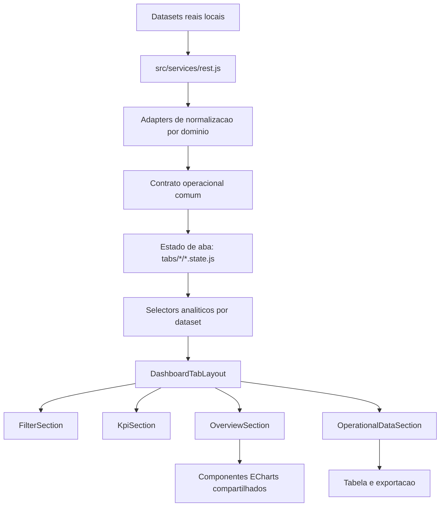
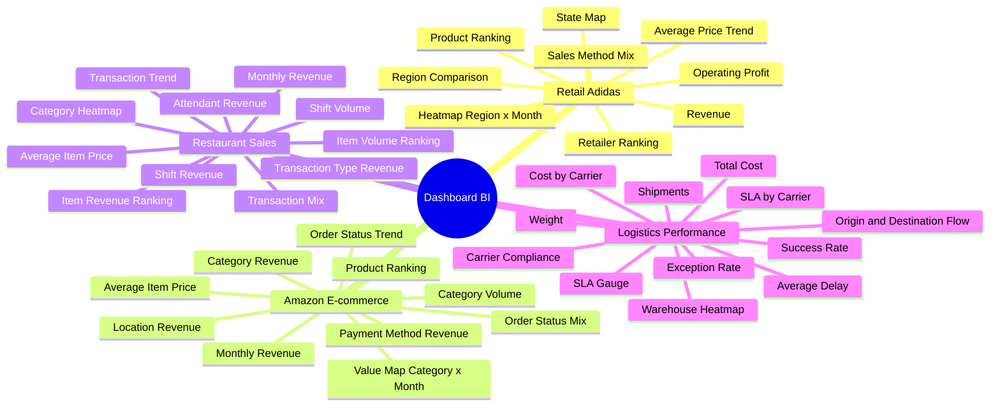

# Dashboard AI/BI Corporativo Multi-Dominio

Aplicacao analitica em React 18 para demonstracao de arquitetura front-end orientada a AI/BI, com ingestao local de datasets reais, normalizacao de contratos heterogeneos, filtros multidimensionais, cross-filtering entre visualizacoes, KPIs executivos, tabelas operacionais, exportacao de dados e assistente de IA generativa contextualizado pelo dashboard ativo.

O produto consolida quatro contextos de negocio em um unico shell corporativo:

| Aba | Dominio | Dataset | Objetivo analitico |
|---|---|---|---|
| Adidas Sales Dataset | Retail | `Adidas US Sales Datasets.xlsx` / `adidasUsSales.json` | Receita, lucro operacional, margem, canais, varejistas, produtos, regioes e mapa por estado |
| Amazon Sales Dataset | E-commerce | `Amazon Sales 2025 Dataset.csv` | Receita, pedidos, ticket medio, status, pagamento, categoria, localidade, produto e mapa de valor temporal |
| Restaurant Sales Dataset | Food service | `Restaurant Sales Dataset.csv` | Receita, pedidos, itens vendidos, turnos, atendentes, tipo de transacao, categorias e preco medio por item |
| Logistics Performance Dataset | Supply chain | `Logistics Shipments Dataset.csv` | Custo logistico, embarques, peso, SLA, atraso medio, carriers, warehouses, destinos, rotas e excecoes |

## Stack Tecnica

| Camada | Tecnologias |
|---|---|
| Runtime | React 18, React DOM 18 |
| Build | Vite 6 |
| UI | Bootstrap 5, React Bootstrap |
| Visualizacao | ECharts, echarts-for-react |
| Dados | CSV, JSON, XLSX, normalizacao client-side |
| Exportacao | xlsx, jspdf, jspdf-autotable |
| Datas | date-fns, react-datepicker |
| Internacionalizacao | i18next, react-i18next |
| Estilos | CSS modular por feature, SCSS no MultiSelect, theming por schema de dashboard |
| Qualidade | Test runner Node para helpers de estado e build de producao Vite |

## Arquitetura



Principios aplicados:

- contrato de dados comum para permitir reutilizacao dos mesmos componentes entre dominios diferentes;
- separacao entre ingestao, normalizacao, estado, selectors e apresentacao;
- lazy loading por aba para reduzir custo inicial do shell;
- theming baseado em `data-dashboard-schema`, com variaveis por dominio para dashboard, barra superior, botoes, cards, filtros e dropdowns em portal;
- cross-filtering padronizado por handlers compartilhados, preservando sincronizacao entre KPIs, graficos e tabela;
- componentes de chart reutilizaveis com parametros de metrica, moeda, locale, ordenacao e semantica de filtro.

## Assistente de IA

O sistema inclui um chatbot de IA generativa que consome o contexto estruturado do dashboard ativo, publicado pelo front-end para apoiar perguntas sobre os dados visiveis e filtrados.

Esse pacote analitico inclui filtros ativos, KPIs, alertas, series temporais, rankings, amostra da tabela operacional e total de linhas. Quando o dataset informa quantidade, o contexto tambem publica a serie temporal de quantidade junto das series de valor, permitindo perguntas sobre evolucao de volume, unidades, itens vendidos ou embarques no mesmo recorte aplicado no dashboard.

## Contrato Analitico

Os datasets de origem possuem nomes e estruturas diferentes, mas convergem para um modelo operacional que sustenta os filtros, agregacoes e graficos:

| Campo normalizado | Papel no dashboard |
|---|---|
| `purchase_order_id` | Identificador de transacao, pedido ou embarque |
| `order_date` | Data base para series temporais e recortes |
| `year_months` | Bucket mensal para tendencias e mapas de calor |
| `client_name` | Dimensao primaria do contexto |
| `supplier_name` | Dimensao secundaria do contexto |
| `product_name` | Produto, rota ou item operacional |
| `product_class_material_name` | Categoria, regiao, origem ou agrupador analitico |
| `quantity_requested` | Volume transacional |
| `unit_price` | Valor unitario ou metrica operacional equivalente |
| `total_amount` | Valor financeiro consolidado |
| `item_status` | Status ou classificacao operacional principal |

Mapeamento por dominio:

| Dominio | `client_name` | `supplier_name` | `product_name` | `product_class_material_name` | `item_status` |
|---|---|---|---|---|---|
| Adidas | State | Retailer | Product | Region | Sales Method |
| Amazon | Customer | Payment Method | Product | Category | Status |
| Restaurant | Shift | Attendant | Menu Item | Item Type | Transaction Type |
| Logistics | Destination | Carrier | Route | Origin Warehouse | Shipment Status |

## Mapa de Analise



## Capacidades Funcionais

- navegacao por quatro datasets reais dentro de um shell unico;
- filtros segmentados por dominio com busca, selecao multipla, selecionar todos e aplicacao controlada;
- dropdowns tematicos aderentes a cada aba, incluindo menus renderizados via portal;
- KPIs com variacao, estado de carregamento, erro e refresh;
- graficos com cross-filter para explorar segmentos diretamente pelas visualizacoes;
- mapas, barras, linhas, stacked bars, treemaps, heatmaps, scatter no dominio Adidas e gauges logisticos;
- tabelas operacionais com busca, exportacao e visualizacao ampliada;
- alternancia claro/escuro mantendo identidade visual por dominio;
- layout responsivo com duas visualizacoes por linha nos grids padrao e graficos full-width apenas quando a leitura analitica exige mais area.

## Estrutura Principal

```text
src/
|-- App.jsx
|-- main.jsx
|-- services/
|   |-- rest.js
|-- mocks/
|   |-- datasetReal/
|-- dashboard/
|   |-- config/
|   |   |-- tabs.config.js
|   |-- components/
|   |   |-- DashboardTabLayout.jsx
|   |   |-- FilterSection.jsx
|   |   |-- KpiSection.jsx
|   |   |-- OverviewSection.jsx
|   |   |-- OperationalDataSection.jsx
|   |   |-- MultiSelectInput/
|   |   |-- shared/
|   |-- hooks/
|   |-- selectors/
|   |-- tabs/
|   |   |-- shared/
|   |   |-- Tab1/
|   |   |-- Tab2/
|   |   |-- Tab3/
|   |   |-- Tab4/
|   |-- index.jsx
|   |-- index.css
|-- styles/
|   |-- app.css
tests/
|-- dashboardTabState.helpers.test.js
|-- run.js
```

## Modelo de Temas

O tema ativo e controlado por `html[data-dashboard-schema]` e `html[data-theme]`.

| Schema | Identidade visual |
|---|---|
| `adidas` | Monocromatico preto/branco, alto contraste, leitura retail |
| `amazon` | Grafite com acento laranja, leitura e-commerce |
| `restaurant` | Marrom escuro, vinho e dourado, leitura food service premium |
| `logistics` | Preto, cinza operacional e vermelho, leitura supply chain |

Esse modelo permite que componentes globais, elementos renderizados em portal e o hero superior acompanhem a aba ativa sem duplicacao de componentes.

## Scripts

```bash
npm install
npm run dev
npm run build
npm test
npm run preview
```

## Qualidade e Validacao

O projeto foi estruturado para demonstrar dominio de:

- modelagem de dados front-end para BI;
- desenho de contratos comuns sobre fontes heterogeneas;
- composicao de dashboards multi-dominio;
- performance por lazy loading e chunking;
- arquitetura de componentes reutilizaveis;
- tematizacao escalavel por schema;
- visualizacao de dados com ECharts;
- exportacao operacional em XLSX e PDF;
- tratamento de loading, erro, empty state e retry;
- manutencao de um produto de portfolio com escopo final claro.
