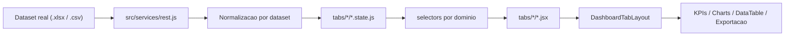

# Dashboard Portfolio de Datasets Reais

## Visao geral

Projeto em React 18 + Vite 6 voltado a portfolio de analytics, no qual cada aba do dashboard representa um dataset real diferente. O objetivo nao e apenas trocar a fonte de dados, mas manter um shell analitico reutilizavel, com identidade visual isolada por dataset, filtros dedicados, tabela operacional compartilhada e componentes graficos reaproveitaveis.

O projeto foi evoluido para suportar multiplos contextos analiticos sem acoplamento entre abas. Cada dataset pode ter:

- pipeline proprio de ingestao e normalizacao;
- selectors e agregacoes dedicados;
- filtros customizados por dominio;
- schema visual proprio;
- composicao analitica adaptada ao contexto do dataset;
- compatibilidade com a infraestrutura compartilhada de KPI, chart, cross-filter e exportacao.

## Status atual das abas

### Abas implementadas com dataset real

- `Adidas Sales Dataset` (`Overview`)
  Dataset: `Adidas US Sales Datasets.xlsx`
  Foco: performance comercial por produto, regiao, retailer, canal e estado.

- `Amazon Sales Dataset` (`Products`)
  Dataset: `Amazon Sales 2025 Dataset.csv`
  Foco: receita, volume, status do pedido, categorias, localidade e meios de pagamento.

- `Restaurant Sales Dataset` (`Clients`)
  Dataset: `Restaurant Sales Dataset.csv`
  Foco: faturamento operacional por turno, atendente, categoria, item e tipo de transacao.

### Abas ainda em construcao

- `Fornecedores`
- `Cotacoes`
- `Pedidos & Logistica`

## Principios da arquitetura

- isolamento por aba: cada fonte real evolui sem interferir nas demais;
- shell compartilhado: layout, tabela operacional, modais, cards e estrutura base continuam comuns;
- schema visual desacoplado: a aba ativa injeta uma identidade visual especifica da empresa ou dataset;
- contrato interno unificado: datasets heterogeneos sao traduzidos para um shape analitico comum;
- extensao incremental: novas abas podem ser ligadas com minimo impacto no restante do projeto.

## Fluxo de dados



## Camadas principais

### 1. Ingestao e normalizacao

Arquivo principal: `src/services/rest.js`

Responsabilidades:

- leitura de datasets reais locais;
- parsing de `.xlsx` e `.csv`;
- padronizacao de datas, moeda, quantidade e status;
- aplicacao de filtros comuns;
- montagem da resposta consumida por cada aba.

Hoje essa camada ja contem pipelines especificos para:

- Adidas;
- Amazon;
- Restaurant.

### 2. Estado por aba

Arquivos principais:

- `src/dashboard/tabs/Overview/overview.state.js`
- `src/dashboard/tabs/Products/products.state.js`
- `src/dashboard/tabs/Clients/clients.state.js`

Responsabilidades:

- manter filtros ativos da aba;
- expor opcoes disponiveis de filtro;
- coordenar cross-filter;
- controlar reset e limpeza;
- desacoplar dimensoes especificas de cada dataset.

### 3. Selectors analiticos por dataset

Arquivos principais:

- `src/dashboard/selectors/overviewSelectors.js`
- `src/dashboard/selectors/amazonSalesSelectors.js`
- `src/dashboard/selectors/restaurantSalesSelectors.js`

Responsabilidades:

- derivar KPIs;
- consolidar rankings;
- construir series temporais;
- preparar dados para pie, treemap, stacked bar, scatter, heatmap e mapas;
- montar tabela operacional normalizada.

Essa separacao permite testar as regras analiticas sem depender da camada visual.

### 4. Shell e componentes compartilhados

Arquivos e diretorios principais:

- `src/dashboard/components/DashboardTabLayout.jsx`
- `src/dashboard/components/OperationalDataSection.jsx`
- `src/dashboard/components/shared/`

Responsabilidades:

- composicao base das abas;
- renderizacao de cards KPI;
- renderizacao dos charts ECharts;
- tabela operacional com busca, exportacao e modal de feedback;
- componentes reutilizaveis de filtros, secoes e modais.

### 5. Schema visual por dataset

Arquivos principais:

- `src/dashboard/index.jsx`
- `src/styles/app.css`
- `src/dashboard/index.css`
- `src/dashboard/components/shared/charts/chartTheme.js`

Funcionamento:

- a aba ativa define o `schema` da interface;
- o schema atual e refletido em `html[data-dashboard-schema]`;
- shell, secoes, cards, tabela e charts leem esse schema para trocar paleta, contraste e tokens visuais;
- cada aba implementada pode ter identidade propria sem contaminar as demais.

Schemas atuais:

- `adidas`
- `amazon`
- `restaurant`
- `default`

## Schema interno de dados

Os datasets reais nao compartilham a mesma estrutura de origem. Para manter a plataforma escalavel, eles sao convertidos para um contrato analitico interno unico.

Campos centrais mais utilizados:

| Campo interno | Papel no dashboard |
|---|---|
| `purchase_order_id` | identificador da linha/pedido |
| `order_date` | data operacional usada em tabela e agregacoes |
| `year_months` | chave de serie temporal mensal |
| `cliente` | primeira dimensao contextual da aba |
| `cidade` | recorte geografico ou operacional secundario |
| `estado` | granularidade territorial para rankings ou mapas |
| `fornecedor` | segunda dimensao contextual da aba |
| `produto` | item principal analisado |
| `categoria` | agrupador de portfolio |
| `quantity_requested` | volume vendido |
| `unit_price` | preco unitario |
| `total_amount` | receita ou valor transacionado |
| `operating_margin` | margem quando disponivel |
| `operating_profit` | lucro quando disponivel |
| `item_status` | status transacional usado por charts e filtros |
| `curve_abc` | classificacao operacional quando aplicavel |

### Mapeamento por dataset

#### Adidas

- `cliente` -> cidade / mercado local
- `fornecedor` -> retailer
- `categoria` -> regiao
- `produto` -> produto Adidas
- `item_status` -> canal de venda

#### Amazon

- `cliente` -> localidade do cliente
- `fornecedor` -> metodo de pagamento
- `categoria` -> categoria do produto
- `produto` -> nome do produto
- `item_status` -> status do pedido

#### Restaurant

- `cliente` -> turno de venda
- `fornecedor` -> atendente
- `categoria` -> tipo de item
- `produto` -> item do menu
- `item_status` -> tipo de transacao

## Escopo analitico por aba

### Adidas Sales Dataset

- KPIs de receita, lucro, margem e unidades;
- filtros por retailer, estado, regiao, produto e canal;
- analise temporal, geografica, canais, rankings e mapa por estado;
- tabela operacional integrada ao cross-filter;
- schema visual da Adidas.

### Amazon Sales Dataset

- KPIs de receita, pedidos, ticket medio e unidades;
- filtros por localidade, cliente, categoria, produto, pagamento e status;
- leitura executiva de tendencia e mix nas primeiras linhas;
- aprofundamento em canais de receita, status e rankings de produtos;
- diagnostico complementar por preco, dispersao e heatmap;
- schema visual da Amazon.

### Restaurant Sales Dataset

- KPIs de receita, pedidos, ticket medio e itens vendidos;
- filtros por turno, atendente, categoria, item e tipo de transacao;
- foco em dinamica operacional de restaurante;
- leitura de faturamento por turno, transacao, atendente e itens;
- diagnostico complementar por preco, dispersao e heatmap;
- schema visual proprio com tons terrosos e pasteis.

## Cross-filter e tabela operacional

As abas implementadas compartilham um mesmo comportamento de exploracao:

- clique nos charts para aplicar filtros contextuais;
- sincronizacao entre visualizacoes e tabela operacional;
- exportacao para planilha e PDF;
- feedback visual para carregamento de exportacoes;
- modal de ampliacao de chart;
- fallback de carregamento em operacoes mais pesadas.

## Performance e manutencao

Decisoes relevantes ja adotadas:

- selectors por dataset para reduzir acoplamento;
- uso de estado por aba para filtros especificos;
- temas por schema ao inves de condicionais espalhadas;
- carregamento e normalizacao local via `rest.js`;
- pontos de defer e transicao nas interacoes mais pesadas;
- estrutura pronta para ampliar testes unitarios em selectors e hooks.

## Estrutura do projeto

```text
src/
|-- App.jsx
|-- main.jsx
|-- services/
|   |-- rest.js
|-- mocks/
|   |-- dashboard/
|   |-- datasetReal/
|-- dashboard/
|   |-- index.jsx
|   |-- index.css
|   |-- selectors/
|   |-- components/
|   |-- tabs/
|       |-- Overview/
|       |-- Products/
|       |-- Clients/
|-- components/
|-- styles/
tests/
|-- run.js
```

## Stack

| Categoria | Tecnologias |
|---|---|
| Runtime | React 18, React DOM 18 |
| Build | Vite 6 |
| UI | React Bootstrap, Bootstrap 5 |
| Charts | ECharts, echarts-for-react |
| Exportacao | xlsx, jspdf, jspdf-autotable |
| Datas | date-fns, react-datepicker |
| i18n | i18next, react-i18next |
| Estilos | CSS por feature + themes por schema |

## Como rodar

Requisitos:

- Node.js 18+
- npm

Instalacao:

```bash
npm install
```

Desenvolvimento:

```bash
npm run dev
```

Build:

```bash
npm run build
```

Testes:

```bash
npm test
```

Preview:

```bash
npm run preview
```

## Roadmap

- conectar novos datasets reais nas abas restantes;
- manter um schema visual isolado por dataset;
- ampliar testes unitarios de selectors e hooks;
- continuar evoluindo performance de charts mais pesados;
- consolidar o projeto como portfolio de analytics com datasets reais do Kaggle.
