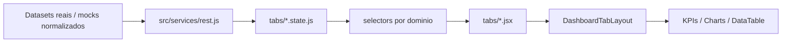

# Dashboard Portfolio de Datasets Reais

## Visao geral

Projeto de portfolio em React 18 + Vite 6 para publicar dashboards analiticos sobre datasets reais, com foco em reaproveitamento de componentes, identidade visual por dataset e experiencia de exploracao analitica.

A arquitetura foi preparada para que cada aba represente a analise de uma fonte real diferente, preservando shell, layout, tabela operacional, filtros e componentes compartilhados.

## Status das abas

- `Adidas Sales Dataset`: implementada com dataset real da Adidas.
- `Produtos`: em construcao.
- `Clientes`: em construcao.
- `Fornecedores`: em construcao.
- `Cotacoes`: em construcao.
- `Pedidos & Logistica`: em construcao.

## Primeira entrega real

A primeira aba real do portfolio utiliza o `Adidas US Sales Dataset`, disponibilizado no Kaggle e normalizado para o contrato interno do dashboard.

Escopo atual da aba Adidas:

- KPIs analiticos;
- filtros dedicados ao dataset;
- cross-filter entre graficos e tabela;
- rankings, serie temporal, dispersao e heatmap;
- tabela operacional com exportacao;
- schema visual isolado da marca.

## Capacidades da plataforma

- filtros combinaveis por aba;
- cross-filter entre visualizacoes;
- tema claro/escuro;
- schema visual desacoplado por dataset/empresa;
- charts reutilizaveis baseados em ECharts;
- exportacao da tabela para XLSX e PDF;
- camada local de dados simulando contrato de API REST.

## Arquitetura



Camadas principais:

- `src/services`: acesso, normalizacao e montagem das respostas consumidas pelas abas;
- `src/dashboard/selectors`: derivacoes analiticas e agregacoes;
- `src/dashboard/tabs/*/*.state.js`: estado, filtros e interacoes por aba;
- `src/dashboard/components`: layout compartilhado;
- `src/dashboard/components/shared`: infraestrutura reutilizavel de chart, KPI e tabela.

## Stack

| Categoria | Tecnologias |
|---|---|
| Runtime | React 18, React DOM 18 |
| Build | Vite 6 |
| UI | React Bootstrap, Bootstrap 5 |
| Charts | ECharts, echarts-for-react |
| Exportacao | xlsx, jspdf, jspdf-autotable |
| Datas | react-datepicker, date-fns |
| i18n | i18next, react-i18next |
| Estilos | CSS por feature + SCSS localizado |

## Como rodar

Requisitos:

- Node.js 18+
- npm

Instalacao:

```bash
npm install
```

Desenvolvimento:

```bash
npm run dev
```

Build:

```bash
npm run build
```

Preview:

```bash
npm run preview
```

## Estrutura principal

```text
src/
|-- App.jsx
|-- main.jsx
|-- services/
|   |-- rest.js
|-- mocks/
|   |-- dashboard/
|   |-- datasetReal/
|-- dashboard/
|   |-- index.jsx
|   |-- selectors/
|   |-- components/
|   |-- tabs/
|-- styles/
```

## Roadmap imediato

- adicionar novas abas baseadas em datasets reais;
- manter schema visual desacoplado por fonte;
- substituir gradualmente mocks genericos por dados reais;
- preservar compatibilidade do shell compartilhado durante a migracao.
