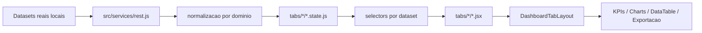

# Dashboard Portfolio de Datasets Reais

## Visao geral

Aplicacao React 18 + Vite 6 para portfolio de BI com quatro dominos analiticos finais, cada um baseado em dataset real e operando sobre um shell compartilhado de exploracao.

Escopo final do projeto:

- `Adidas Sales Dataset`
- `Amazon Sales Dataset`
- `Restaurant Sales Dataset`
- `Logistics Performance Dataset`

As abas `Cotacoes` e `Pedidos & Logistica` foram removidas do produto, do bootstrap de navegacao e da camada de dados. O repositorio agora reflete apenas o escopo final homologado.

## Estado final das abas

### 1. Adidas

- dataset: `src/mocks/datasetReal/adidasUsSales.json`
- foco: receita, lucro, margem, unidades, regioes, retailers, canais e mapa por estado
- schema visual: `adidas`

### 2. Amazon

- dataset: `src/mocks/datasetReal/Amazon Sales 2025 Dataset.csv`
- foco: receita, pedidos, ticket medio, categorias, localidade, pagamento e status
- schema visual: `amazon`

### 3. Restaurant

- dataset: `src/mocks/datasetReal/Restaurant Sales Dataset.csv`
- foco: faturamento operacional, turnos, atendentes, itens, categorias e tipo de transacao
- schema visual: `restaurant`

### 4. Logistics

- dataset: `src/mocks/datasetReal/Logistics Shipments Dataset.csv`
- foco: custo logistico, embarques, SLA, atraso, carriers, warehouses, destinos e rotas
- schema visual: `default`

## Arquitetura consolidada

Fluxo principal:



Pontos estruturais do estado final:

- navegacao centralizada em `src/dashboard/config/tabs.config.js`;
- shell das abas lazy-loaded para reduzir custo inicial;
- camada `rest.js` reduzida aos quatro datasets ativos, sem mocks legados;
- cross-filter padronizado nos helpers compartilhados;
- selectors por dataset preservando contrato analitico e separacao de regras de negocio;
- componentes compartilhados reutilizados entre as quatro abas finais.

## Contrato interno de dados

Os datasets sao heterogeneos na origem e convergem para um contrato interno comum. Campos centrais:

| Campo | Papel |
|---|---|
| `purchase_order_id` | identificador operacional |
| `order_date` | data base para agregacoes |
| `year_months` | bucket mensal |
| `client_name` | dimensao primaria do contexto |
| `supplier_name` | dimensao secundaria |
| `product_name` | item principal analisado |
| `product_class_material_name` | categoria ou agrupador analitico |
| `quantity_requested` | volume operacional |
| `unit_price` | preco unitario |
| `total_amount` | valor financeiro |
| `item_status` | status principal para filtros e charts |

Mapeamento dominante por aba:

- Adidas: `client_name=state`, `supplier_name=retailer`, `product_class_material_name=region`, `item_status=sales_method`
- Amazon: `client_name=customer`, `supplier_name=payment_method`, `product_class_material_name=category`, `item_status=status`
- Restaurant: `client_name=shift`, `supplier_name=attendant`, `product_class_material_name=item_type`, `item_status=transaction_type`
- Logistics: `client_name=destination`, `supplier_name=carrier`, `product_class_material_name=origin_warehouse`, `item_status=shipment_status`

## Performance e manutencao

Ajustes finais aplicados:

- remocao de abas, selectors e mocks fora do escopo;
- centralizacao da configuracao de tabs para reduzir duplicacao e risco de drift;
- consolidacao dos handlers de cross-filter repetidos em helper compartilhado;
- reducao da camada de servico para somente datasets ativos;
- `manualChunks` no Vite para distribuir melhor bibliotecas pesadas como `echarts`, `xlsx` e `jspdf`;
- lazy loading das tabs mantido para preservar responsividade do shell.

## Estrutura principal

```text
src/
|-- App.jsx
|-- main.jsx
|-- services/
|   |-- rest.js
|-- mocks/
|   |-- datasetReal/
|-- dashboard/
|   |-- config/
|   |   |-- tabs.config.js
|   |-- components/
|   |-- hooks/
|   |-- selectors/
|   |-- tabs/
|   |   |-- Overview/
|   |   |-- Products/
|   |   |-- Clients/
|   |   |-- Suppliers/
|   |-- index.jsx
|   |-- index.css
|-- styles/
tests/
|-- dashboardTabState.helpers.test.js
|-- run.js
```

## Stack

| Categoria | Tecnologias |
|---|---|
| Runtime | React 18, React DOM 18 |
| Build | Vite 6 |
| UI | Bootstrap 5, React Bootstrap |
| Charts | ECharts, echarts-for-react |
| Exportacao | xlsx, jspdf, jspdf-autotable |
| Datas | date-fns, react-datepicker |
| i18n | i18next, react-i18next |
| Estilos | CSS por feature e themes por schema |

## Como rodar

Requisitos:

- Node.js 18+
- npm

Instalacao:

```bash
npm install
```

Desenvolvimento:

```bash
npm run dev
```

Build:

```bash
npm run build
```

Testes:

```bash
npm test
```

Preview:

```bash
npm run preview
```

## Encerramento do projeto

Este repositorio esta alinhado com o estado final do projeto para entrega:

- apenas quatro abas finais ativas;
- sem codigo ou mocks de abas descontinuadas na navegacao e na camada de dados;
- arquitetura documentada conforme implementacao real;
- build e testes validando o baseline final.
