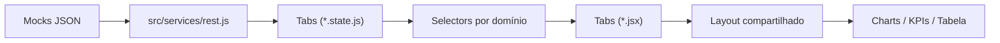
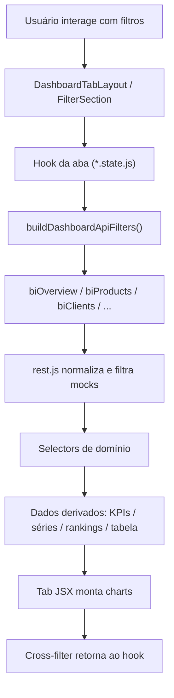
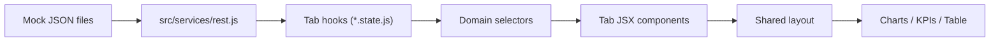
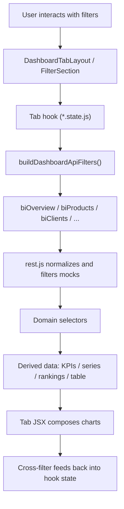

# Demonstração Dashboard Corporativo

[Português (Brasil)](#português-brasil) | [English](#english)

---

## Português (Brasil)

### Visão Geral

O objetivo aqui foi criar um aplicativo executável de forma isolada, preservando a experiência de dashboard corporativo, a estrutura de filtros, os gráficos analíticos, a tabela operacional e o contrato de dados esperado pela UI.

Em vez de depender do backend original, o projeto roda sobre uma camada local de serviços mockados que simula respostas de API REST.  
Isso permite:

- desenvolver a feature fora de um sistema principal;
- validar arquitetura, layout, performance e experiência;
- testar ajustes de UX e visualização com segurança;
- evoluir a base como um sandbox de BI reutilizável.

---

### Principais Características

- Aplicação React + Vite com execução standalone.
- Dashboard corporativo com 6 abas analíticas.
- Dados mockados normalizados para o mesmo shape esperado pela feature original.
- Filtros combináveis com cross-filter entre gráficos.
- Layout compartilhado entre abas.
- Selectors por domínio para derivação de KPIs, rankings, séries e tabelas.
- Componentes reutilizáveis para gráficos, KPIs, filtros e tabela operacional.
- Tooltip responsivo compartilhado para os gráficos.
- Mapa do Brasil com ECharts.
- Exportação e manipulação tabular na seção operacional.

---

### Stack

| Categoria | Tecnologias |
|---|---|
| Runtime | React 18, React DOM 18 |
| Build | Vite 6 |
| UI Base | React Bootstrap, Bootstrap 5 |
| Gráficos | ECharts, echarts-for-react |
| Data picker | react-datepicker, date-fns |
| Ícones | react-icons, feather-icons |
| Estilos | CSS modular por feature + SCSS em componentes específicos |
| Exportação | xlsx, jspdf, jspdf-autotable |
| i18n | i18next, react-i18next |

---

### Como Rodar

#### Pré-requisitos

- Node.js 18+ recomendado
- npm

#### Instalação

```bash
npm install
```

#### Desenvolvimento

```bash
npm run dev
```

#### Build de produção

```bash
npm run build
```

#### Preview local

```bash
npm run preview
```

---

### Arquitetura Aplicada

O projeto foi reorganizado para seguir uma arquitetura em camadas, reduzindo acoplamento entre tela, fetch, transformação de dados e regras analíticas.

#### Fluxo macro



#### Fluxo detalhado por aba



#### Camadas

| Camada | Responsabilidade |
|---|---|
| `src/services` | Simular a API REST e devolver dados no contrato esperado pelos hooks |
| `src/dashboard/hooks` | Padronizar filtros, reset, cross-filter, estado de UI e contratos compartilhados |
| `src/dashboard/selectors` | Normalizar dados e derivar métricas, rankings, séries e opções de filtro |
| `src/dashboard/tabs/*/*.state.js` | Orquestrar carregamento, filtros, selectors e estado da aba |
| `src/dashboard/tabs/*/*.jsx` | Compor visualmente a aba usando o layout compartilhado |
| `src/dashboard/components` | Reutilizar blocos de UI de alto nível |
| `src/dashboard/components/shared` | Reutilizar charts, tabela e cards em toda a solução |

---

### Mapa da Estrutura

```text
dashboard/
├─ package.json
├─ vite.config.js
├─ src/
│  ├─ App.jsx
│  ├─ main.jsx
│  ├─ i18n.js
│  ├─ components/
│  │  └─ ModalV2.jsx
│  ├─ core/
│  │  └─ auth.js
│  ├─ services/
│  │  └─ rest.js
│  ├─ styles/
│  │  └─ app.css
│  ├─ dashboard/
│  │  ├─ index.jsx
│  │  ├─ index.css
│  │  ├─ mocks/
│  │  ├─ hooks/
│  │  ├─ selectors/
│  │  ├─ components/
│  │  └─ tabs/
│  ├─ mocks/
│  │  └─ api/
│  └─ views/
│     └─ erp/dashboard/mocks/
└─ README.md
```

---

### Guia de Pastas e Arquivos

## 1. Raiz do projeto

| Arquivo | Função |
|---|---|
| `package.json` | Define scripts, dependências e metadados do app standalone |
| `vite.config.js` | Configuração do Vite |
| `index.html` | HTML base do app |
| `BLUEPRINT_BI_STANDALONE_V2.md` | Documento de blueprint arquitetural do projeto |

## 2. Shell standalone

| Arquivo | Função |
|---|---|
| `src/main.jsx` | Ponto de entrada do app, inicializa React, Bootstrap, i18n e silencia ruídos de startup |
| `src/App.jsx` | Shell visual principal com hero/header e montagem do dashboard |
| `src/styles/app.css` | Estilos globais da aplicação standalone |
| `src/i18n.js` | Configuração mínima de internacionalização |
| `src/core/auth.js` | Stub local de autenticação para reproduzir o contrato do SaaS original |
| `src/components/ModalV2.jsx` | Implementação local simplificada do modal usado pela feature |

## 3. Camada de serviços

| Arquivo | Função |
|---|---|
| `src/services/rest.js` | Coração da simulação de API. Importa mocks, normaliza linhas, aplica filtros e devolve respostas por domínio (`biOverview`, `biProducts`, `biClients`, `biSuppliers`, `biQuotations`, `biOrdersLogistics`) |

#### O que `rest.js` faz

- converte mocks originais em um contrato próximo ao backend;
- gera IDs sintéticos de cliente, fornecedor e produto;
- deriva `year_months`, status e classificações;
- aplica filtros compartilhados;
- devolve `fact`, `table` e `kpis` conforme cada domínio.

---

## 4. Núcleo do dashboard

| Arquivo | Função |
|---|---|
| `src/dashboard/index.jsx` | Container principal do módulo BI. Controla a aba ativa e lazy loads de cada tab |
| `src/dashboard/index.css` | Estilos globais do container do dashboard e navegação por abas |

#### Abas disponíveis

- Visão Geral
- Produtos
- Clientes
- Fornecedores
- Cotações
- Pedidos & Logística

---

## 5. Hooks compartilhados

| Arquivo | Função |
|---|---|
| `src/dashboard/hooks/dashboardTabState.helpers.js` | Padroniza criação de filtros, mapeamento para API, limpeza de estado, cross-filter e contrato de opções |
| `src/dashboard/hooks/useDashboardTabUi.js` | Centraliza `resetToken`, modal de período e visibilidade do botão flutuante de limpar |
| `src/dashboard/hooks/useDashboardFilters.js` | Base legada/auxiliar para lógica de filtros do dashboard |
| `src/dashboard/hooks/useFilterSectionOptions.js` | Monta a lista de filtros visíveis e seu schema para a `FilterSection` |
| `src/dashboard/hooks/useFormatter.js` | Helpers de formatação usados por partes da UI |
| `src/dashboard/hooks/useKpiVariation.js` | Calcula variação comparativa para KPIs |
| `src/dashboard/hooks/useLocalChartReset.js` | Auxilia reset local em componentes gráficos |

---

## 6. Selectors compartilhados e de domínio

### Shared

| Arquivo | Função |
|---|---|
| `src/dashboard/selectors/shared/dashboardSelectors.js` | Biblioteca de transformação: limpeza de strings, números, ordenação, listas únicas, opções de filtro e month keys |

### Domínio

| Arquivo | Função |
|---|---|
| `src/dashboard/selectors/overviewSelectors.js` | Normaliza dados da visão geral e deriva KPIs, histórico mensal, pizza por categoria, rankings, mapa por UF e tabela |
| `src/dashboard/selectors/productsSelectors.js` | Consolida KPIs de produtos, glosa, curva ABC, rankings, histórico e filtros disponíveis |
| `src/dashboard/selectors/clientsSelectors.js` | Gera KPIs e visão analítica de clientes, incluindo rankings, ticket médio, curva ABC/XYZ e mapa por estado |
| `src/dashboard/selectors/suppliersSelectors.js` | Gera KPIs e visão de fornecedores com SLA, glosa, atrasos, volume e categorias |
| `src/dashboard/selectors/ordersSelectors.js` | Gera KPIs e visão operacional/logística de pedidos, status, evolução mensal e mapa por UF |
| `src/dashboard/selectors/quotationsSelectors.js` | Normaliza dados de cotações e monta tabela/filtros disponíveis |

#### Padrão dos selectors

Cada domínio normalmente segue três passos:

1. `normalize*`  
   Converte o shape vindo do serviço para um modelo mais amigável à UI.

2. `build*DerivedData`  
   Calcula KPIs, rankings, séries, mapas e agregações.

3. `build*AvailableFilters`  
   Monta as opções dinâmicas dos filtros.

---

## 7. Componentes compartilhados de alto nível

| Arquivo | Função |
|---|---|
| `src/dashboard/components/DashboardTabLayout.jsx` | Layout padrão de uma aba: filtros, KPIs, visão geral, tabela operacional e botão limpar |
| `src/dashboard/components/DashboardDateFilterModal.jsx` | Modal padronizado de filtro por período |
| `src/dashboard/components/SectionWrapper.jsx` | Casca colapsável de cada seção |
| `src/dashboard/components/FilterSection.jsx` | Renderiza os filtros em formato de carrossel horizontal |
| `src/dashboard/components/KpiSection.jsx` | Renderiza a grade de KPIs com mapeamento padrão |
| `src/dashboard/components/OverviewSection.jsx` | Organiza os gráficos em grid responsivo com até 2 por linha |
| `src/dashboard/components/OperationalDataSection.jsx` | Renderiza a tabela operacional, zoom, expansão e modal |

### Componentes auxiliares de filtro

| Arquivo | Função |
|---|---|
| `src/dashboard/components/MultiSelectInput/index.jsx` | Campo de seleção múltipla para filtros |
| `src/dashboard/components/MultiSelectInput/styles.scss` | Estilo do multiselect |
| `src/dashboard/components/DateRangePicker/index.jsx` | Campo de período/data |
| `src/dashboard/components/DateRangePicker/styles.scss` | Estilo do date range picker |

### Estilos dos componentes de alto nível

| Arquivo | Função |
|---|---|
| `FilterSection.css` | Estilo do carrossel de filtros |
| `KpiSection.css` | Estilo do grid de KPIs |
| `OperationalDataSection.css` | Estilo da seção operacional |
| `OverviewSection.css` | Estilo do grid de gráficos |
| `SectionWrapper.css` | Estilo da casca das seções |

---

## 8. Componentes compartilhados de baixo nível

### Charts

| Arquivo | Função |
|---|---|
| `src/dashboard/components/shared/charts/chartTooltip.helpers.js` | Tooltip HTML responsivo compartilhado entre os gráficos |
| `ChartBarVertical/ChartBarVertical.jsx` | Wrapper React do gráfico de barras verticais |
| `ChartBarVertical/chartBarVertical.state.js` | Monta option, tooltip, ordenação e cross-filter do gráfico de barras verticais |
| `ChartHorizontal/ChartHorizontal.jsx` | Wrapper React do gráfico de ranking horizontal |
| `ChartHorizontal/chartHorizontal.state.js` | Monta aggregations, tooltip e option do gráfico horizontal |
| `ChartLine/ChartLine.jsx` | Wrapper React do gráfico de linha |
| `ChartLine/chartLine.state.js` | Consolida médias mensais, tooltip e interação do gráfico de linha |
| `ChartMap/ChartMap.jsx` | Wrapper React do mapa do Brasil |
| `ChartMap/chartMap.state.js` | Agrega valor por UF, registra mapa no ECharts e configura tooltip/interação |
| `ChartPie/ChartPie.jsx` | Wrapper React do gráfico de pizza/donut |
| `ChartPie/chartPie.state.js` | Estado interno do pie, seleção e visual filter |
| `ChartTreemap/ChartTreemap.jsx` | Wrapper React do treemap de status/classificações |
| `ChartTreemap/chartTreemap.state.js` | Agregação e controle de interação do treemap |
| `GaugeCount/GaugeCount.jsx` | Gauge para indicadores percentuais |
| `GaugeCount/gaugeCount.state.js` | Estado e option do gauge |

### DataTable

| Arquivo | Função |
|---|---|
| `shared/dataTable/DataTable.jsx` | Tabela reutilizável com exportação e recursos extras |
| `shared/dataTable/dataTable.state.js` | Estado interno da tabela |
| `shared/dataTable/DataTable.css` | Estilo da tabela |

### KPI Card

| Arquivo | Função |
|---|---|
| `shared/kpiCard/KpiCard.jsx` | Card individual de KPI |
| `shared/kpiCard/kpiCard.state.js` | Lógica interna do KPI card |
| `shared/kpiCard/KpiCard.css` | Estilo do card |

---

## 9. Abas do dashboard

Cada aba segue o padrão:

- `*.state.js`: orquestra dados e estado;
- `*.jsx`: compõe a interface;
- `*.css`: personalizações visuais da aba;
- `index.js`: export simples do módulo.

### Visão Geral

| Arquivo | Função |
|---|---|
| `tabs/Overview/overview.state.js` | Consome `biOverview`, normaliza analytics/tabela e gera dados da home analítica |
| `tabs/Overview/Overview.jsx` | Monta gráficos de histórico, pizza, treemap, rankings, mapa e linha |
| `tabs/Overview/Overview.css` | Estilos específicos da aba |

### Produtos

| Arquivo | Função |
|---|---|
| `tabs/Products/products.state.js` | Consome `biProducts`, aplica selectors e disponibiliza dados operacionais/analíticos |
| `tabs/Products/Products.jsx` | Monta gráficos de categoria, ranking, linha, glosa e treemap |
| `tabs/Products/Products.css` | Estilos específicos da aba |

### Clientes

| Arquivo | Função |
|---|---|
| `tabs/Clients/clients.state.js` | Consome `biClients` e aplica selectors de clientes |
| `tabs/Clients/Clients.jsx` | Monta rankings, mapa, pizza, treemap e linha para clientes |
| `tabs/Clients/Clients.css` | Estilos específicos da aba |

### Fornecedores

| Arquivo | Função |
|---|---|
| `tabs/Suppliers/suppliers.state.js` | Consome `biSuppliers` e aplica selectors de fornecedores |
| `tabs/Suppliers/Suppliers.jsx` | Monta gauges, histórico, glosa, volume, ranking e pizza |
| `tabs/Suppliers/Suppliers.css` | Estilos específicos da aba |

### Pedidos & Logística

| Arquivo | Função |
|---|---|
| `tabs/Orders/orders.state.js` | Consome `biOrdersLogistics` e aplica selectors operacionais |
| `tabs/Orders/Orders.jsx` | Monta treemap, mapa, rankings e evolução mensal |
| `tabs/Orders/Orders.css` | Estilos específicos da aba |

### Cotações

| Arquivo | Função |
|---|---|
| `tabs/Quotations/quotations.state.js` | Consome `biQuotations`, normaliza tabela/fact e prepara filtros |
| `tabs/Quotations/Quotations.jsx` | Monta histórico mensal, linha, mapa e rankings de produtos/fornecedores |
| `tabs/Quotations/Quotations.css` | Estilos específicos da aba |

### Tema compartilhado das abas

| Arquivo | Função |
|---|---|
| `tabs/shared/dashboardTabTheme.css` | Base visual comum para todas as abas |

---

## 10. Mocks

| Pasta / Arquivo | Função |
|---|---|
| `src/dashboard/mocks/dashboardOverview.mock.json` | Dados mockados da visão geral |
| `src/dashboard/mocks/dashboardProducts.mock.json` | Dados mockados de produtos |
| `src/dashboard/mocks/dashboardClients.mock.json` | Dados mockados de clientes |
| `src/dashboard/mocks/dashboardSuppliers.mock.json` | Dados mockados de fornecedores |
| `src/dashboard/mocks/dashboardOrders.mock.json` | Dados mockados de pedidos |
| `src/dashboard/mocks/dashboardQuotations.mock.json` | Dados mockados de cotações |
| `src/dashboard/mocks/brasil.geo.json` | GeoJSON oficial usado pelo mapa |
| `src/views/erp/dashboard/mocks/brasil.geo.json` | Cópia legada/compatibilidade de asset |
| `src/mocks/api/` | Espaço reservado para evolução de mocks de API mais granularizados |

---

### Contrato de Dados

O projeto trabalha com um shape normalizado no serviço local, para aproximar o comportamento do backend real.

#### Campos recorrentes

| Campo | Significado |
|---|---|
| `client_id`, `client_name` | Identificação e nome do cliente |
| `supplier_id`, `supplier_name` | Identificação e nome do fornecedor |
| `product_id`, `product_name` | Identificação e nome do produto |
| `product_class_material_name` | Categoria/material |
| `client_state` | UF do cliente |
| `order_date` | Data operacional do registro |
| `year_months` | Mês derivado no formato `YYYY-MM` |
| `purchase_order_id` | Número/código de pedido |
| `quotation_code` | Número/código de cotação |
| `sum_quantity`, `quantity_requested` | Volume/quantidade |
| `sum_total_amount`, `total_amount` | Valor total |
| `avg_unit_price`, `unit_price` | Preço unitário médio |
| `item_status`, `quotation_status`, `order_status` | Status conforme o domínio |

#### Tipos de resposta

| Chave | Significado |
|---|---|
| `fact` | Base analítica principal |
| `table` | Base operacional para tabela |
| `kpis` | KPIs prontos ou semi-prontos por domínio |
| `alertas` | Estrutura opcional para mini-cards/alertas |

---

### Estratégia de Filtros e Cross-Filter

O projeto suporta dois níveis principais de filtragem:

1. filtros explícitos da barra de filtros;
2. filtros disparados por interação em gráficos.

#### Filtros padrão da UI

- `dateRange`
- `suppliers`
- `clients`
- `categorias`
- `produtos`
- `orders`
- `status`
- `mes`
- `uf`

#### Como o cross-filter funciona

- o gráfico dispara um payload com `type`, `value` e, quando necessário, `id`;
- `createCrossFilterHandler()` interpreta esse payload;
- `createCrossFilterMap()` converte a interação em atualização real dos filtros;
- o hook da aba recarrega dados a partir do serviço mockado;
- a aba é rerenderizada com a nova visão analítica.

---

### Padrão de Desenvolvimento de uma Nova Aba

Para adicionar uma nova aba seguindo o padrão atual:

1. criar a pasta `src/dashboard/tabs/NovaAba/`;
2. criar `NovaAba.jsx`, `novaAba.state.js`, `NovaAba.css` e `index.js`;
3. expor um serviço mockado em `src/services/rest.js`;
4. criar selectors em `src/dashboard/selectors/novaAbaSelectors.js`;
5. reutilizar `DashboardTabLayout`;
6. conectar a aba em `src/dashboard/index.jsx`.

#### Padrão recomendado

```text
service -> state hook -> selectors -> tab jsx -> shared layout -> charts/table
```

---

### Decisões de Arquitetura

#### Por que usar selectors

- evita lógica pesada dentro dos componentes React;
- facilita padronização entre abas;
- melhora testabilidade;
- separa transformação de dados de renderização.

#### Por que manter `rest.js` local

- substitui o backend original de forma controlada;
- permite simular contratos reais;
- reduz acoplamento ao SaaS;
- facilita evolução futura para mock server ou backend real.

#### Por que usar `DashboardTabLayout`

- padroniza a experiência visual;
- reduz duplicação em `*.jsx`;
- centraliza a ordem e a composição das seções;
- mantém a evolução de UX consistente entre abas.

---

### Pontos de Atenção

- O projeto ainda carrega alguns textos com encoding legado em partes da UI e do código.
- O chunk do mapa ainda é pesado por causa do GeoJSON e do ECharts.
- Existem alguns assets/pastas legadas mantidos por compatibilidade estrutural.
- A solução hoje é orientada a mocks; plugar um backend real exigirá adaptação do contrato em `rest.js` ou substituição dessa camada.

---

### Roadmap Técnico Sugerido

- corrigir encoding remanescente;
- quebrar o bundle do mapa com lazy loading mais agressivo;
- mover `rest.js` para uma camada de adapters/clients separada;
- adicionar testes para selectors e hooks;
- documentar contratos por domínio em arquivos próprios;
- criar datasets mockados por cenário de negócio.

---

### Licença

Defina aqui a licença desejada para o projeto.  
Se o repositório ainda não tiver uma licença formal, considere adicionar um arquivo `LICENSE`.

---

## English

### Overview

This project is a standalone extraction of a BI module originally built inside a larger SaaS platform.  
Its goal is to run the feature independently while preserving the corporate dashboard experience, filter behavior, analytical charts, operational table, and the data contract expected by the original UI.

Instead of relying on the original backend, the app runs on top of a local mocked service layer that simulates REST API responses.  
This makes it possible to:

- develop the feature outside the main system;
- validate architecture, layout, performance, and UX;
- safely test visualization and interaction improvements;
- evolve the module as a reusable BI sandbox.

---

### Key Features

- Standalone React + Vite application.
- Corporate BI dashboard with 6 analytical tabs.
- Mocked data normalized to the contract expected by the original feature.
- Combined filters with chart-driven cross-filter behavior.
- Shared layout across tabs.
- Domain selectors for KPIs, rankings, time series, and tables.
- Reusable chart, KPI, filter, and operational table components.
- Shared responsive tooltip system for charts.
- Brazil map built with ECharts.
- Table export and operational inspection features.

---

### Tech Stack

| Category | Technologies |
|---|---|
| Runtime | React 18, React DOM 18 |
| Build | Vite 6 |
| UI Base | React Bootstrap, Bootstrap 5 |
| Charts | ECharts, echarts-for-react |
| Date picker | react-datepicker, date-fns |
| Icons | react-icons, feather-icons |
| Styling | Feature-oriented CSS + SCSS in specific components |
| Export | xlsx, jspdf, jspdf-autotable |
| i18n | i18next, react-i18next |

---

### Running the Project

#### Requirements

- Node.js 18+ recommended
- npm

#### Install

```bash
npm install
```

#### Development

```bash
npm run dev
```

#### Production build

```bash
npm run build
```

#### Local preview

```bash
npm run preview
```

---

### Applied Architecture

The project follows a layered approach to reduce coupling between rendering, data fetching, transformations, and analytical rules.

#### High-level flow



#### Detailed tab flow



#### Layers

| Layer | Responsibility |
|---|---|
| `src/services` | Simulate REST APIs and return data in the contract expected by the dashboard |
| `src/dashboard/hooks` | Standardize filters, reset behavior, cross-filtering, and shared UI state |
| `src/dashboard/selectors` | Normalize data and derive metrics, rankings, charts, and filter options |
| `src/dashboard/tabs/*/*.state.js` | Orchestrate loading, filtering, selectors, and tab state |
| `src/dashboard/tabs/*/*.jsx` | Compose each tab visually using the shared layout |
| `src/dashboard/components` | High-level reusable UI building blocks |
| `src/dashboard/components/shared` | Low-level reusable charts, table, and KPI cards |

---

### Project Structure Guide

#### Root and standalone shell

- `package.json`: scripts and dependencies
- `src/main.jsx`: app bootstrap
- `src/App.jsx`: standalone shell and hero section
- `src/styles/app.css`: global standalone styling
- `src/i18n.js`: minimal i18n config
- `src/core/auth.js`: local auth stub
- `src/components/ModalV2.jsx`: local modal replacement

#### Service layer

- `src/services/rest.js`: mocked API layer, row normalization, filter application, and domain-specific responses

#### Dashboard core

- `src/dashboard/index.jsx`: tab container and lazy loading
- `src/dashboard/hooks/*`: shared tab behavior
- `src/dashboard/selectors/*`: domain data derivation
- `src/dashboard/components/*`: shared layout sections
- `src/dashboard/components/shared/*`: charts, table, KPI card
- `src/dashboard/tabs/*`: each BI tab implementation
- `src/dashboard/mocks/*`: source datasets and Brazil map

---

### Shared UI Building Blocks

| File | Responsibility |
|---|---|
| `DashboardTabLayout.jsx` | Standard tab shell |
| `DashboardDateFilterModal.jsx` | Shared date modal |
| `FilterSection.jsx` | Horizontal filter carousel |
| `KpiSection.jsx` | KPI grid |
| `OverviewSection.jsx` | Responsive chart grid |
| `OperationalDataSection.jsx` | Operational table wrapper |
| `SectionWrapper.jsx` | Collapsible section card |

---

### Shared Low-Level Components

| Area | Files | Responsibility |
|---|---|---|
| Charts | `ChartBarVertical`, `ChartHorizontal`, `ChartLine`, `ChartMap`, `ChartPie`, `ChartTreemap`, `GaugeCount` | Reusable ECharts-based visualizations |
| Tooltip | `chartTooltip.helpers.js` | Shared responsive HTML tooltip behavior |
| Table | `shared/dataTable/*` | Operational table and exports |
| KPI | `shared/kpiCard/*` | KPI card rendering |

---

### Domain Tabs

| Tab | Purpose |
|---|---|
| Overview | Executive BI summary with value history, category distribution, logistics status, rankings, map, and unit-price evolution |
| Products | Product performance, category distribution, unit-price evolution, glosa percentage, and status treemap |
| Clients | Client-centric analytics with rankings, category distribution, map, treemap, and ticket evolution |
| Suppliers | Supplier performance, SLA, glosa, delays, volume, ranking, and category distribution |
| Orders & Logistics | Operational order tracking, logistics status, map, rankings, and monthly value evolution |
| Quotations | Quotation KPIs, monthly history, geographic spread, and product/supplier rankings |

---

### Data Contract

The app relies on a normalized local contract that mimics the expected backend behavior.

#### Common fields

| Field | Meaning |
|---|---|
| `client_id`, `client_name` | Client identity |
| `supplier_id`, `supplier_name` | Supplier identity |
| `product_id`, `product_name` | Product identity |
| `product_class_material_name` | Category / material class |
| `client_state` | Client state (UF) |
| `order_date` | Operational date |
| `year_months` | Derived `YYYY-MM` key |
| `purchase_order_id` | Order code |
| `quotation_code` | Quotation code |
| `sum_quantity`, `quantity_requested` | Quantity / volume |
| `sum_total_amount`, `total_amount` | Monetary total |
| `avg_unit_price`, `unit_price` | Unit price |
| `item_status`, `quotation_status`, `order_status` | Domain-specific status fields |

---

### Filter and Cross-Filter Strategy

The dashboard supports two filtering layers:

1. explicit filters in the filter section;
2. implicit cross-filters triggered by chart interaction.

The shared helpers in `dashboardTabState.helpers.js` are responsible for:

- building initial filter state;
- translating UI filters into API filters;
- clearing state consistently;
- mapping chart interaction payloads into actual filter updates.

---

### Suggested Extension Path

To add a new tab following the current pattern:

1. add a service entry in `src/services/rest.js`;
2. create domain selectors in `src/dashboard/selectors/`;
3. create a `*.state.js` hook in `src/dashboard/tabs/NewTab/`;
4. create the visual composition in `NewTab.jsx`;
5. reuse `DashboardTabLayout`;
6. wire the tab into `src/dashboard/index.jsx`.

---

### Notes

- Some labels still contain legacy encoding artifacts inherited from the original feature.
- The Brazil map bundle is still heavy due to ECharts + GeoJSON.
- The current app is mock-driven by design; integrating a real backend should happen behind the service layer.

---

### License

Add the license that best matches your intended distribution model.  
If the repository still does not include a formal license, consider adding a `LICENSE` file.

