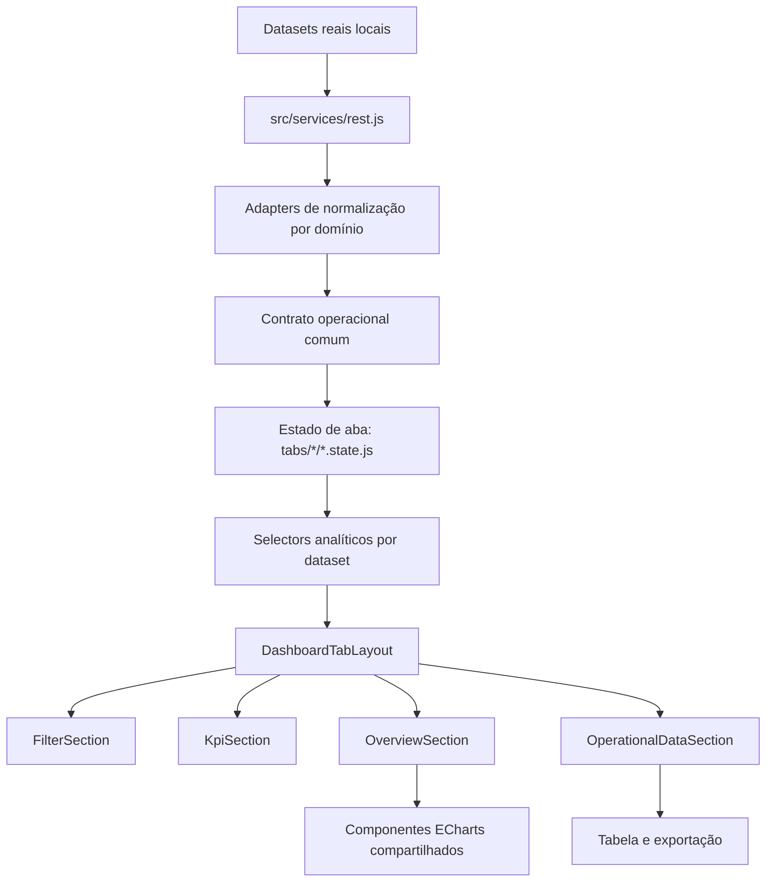
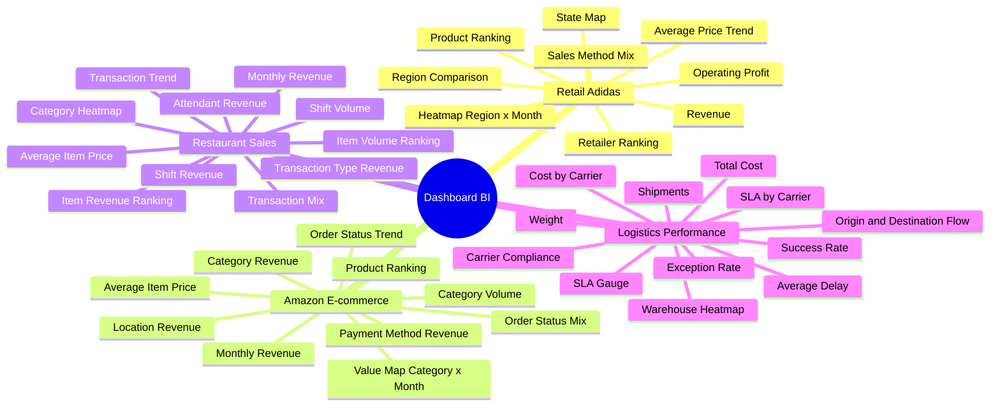

# Dashboard AI/BI Corporativo Multi-Domínio

Aplicação analítica em React 18 para demonstração de arquitetura front-end orientada a AI/BI com ingestão local de datasets reais, normalização de contratos heterogêneos, filtros multidimensionais, cross-filtering entre visualizações, KPIs executivos, tabelas operacionais, exportação de dados e assistente de IA generativa contextualizado pelo dashboard ativo.

O produto consolida quatro contextos de negócio em um único shell corporativo:

| Aba | Domínio | Dataset | Objetivo analítico |
|---|---|---|---|
| Adidas Sales Dataset | Retail | `Adidas US Sales Datasets.xlsx` / `adidasUsSales.json` | Receita, lucro operacional, margem, canais, varejistas, produtos, regiões e mapa por estado |
| Amazon Sales Dataset | E-commerce | `Amazon Sales 2025 Dataset.csv` | Receita, pedidos, ticket médio, status, pagamento, categoria, localidade, produto e mapa de valor temporal |
| Restaurant Sales Dataset | Food service | `Restaurant Sales Dataset.csv` | Receita, pedidos, itens vendidos, turnos, atendentes, tipo de transação, categorias e preço médio por item |
| Logistics Performance Dataset | Supply chain | `Logistics Shipments Dataset.csv` | Custo logístico, embarques, peso, SLA, atraso médio, carriers, warehouses, destinos, rotas e exceções |

## Stack Técnica

| Camada | Tecnologias |
|---|---|
| Runtime | React 18, React DOM 18 |
| Build | Vite 6 |
| UI | Bootstrap 5, React Bootstrap |
| Visualização | ECharts, echarts-for-react |
| Dados | CSV, JSON, XLSX |
| Exportacao | xlsx, jspdf, jspdf-autotable |
| Datas | date-fns, react-datepicker |
| Internacionalização | i18next, react-i18next |
| Estilos | CSS modular por feature, SCSS no MultiSelect, theming por schema de dashboard |
| Qualidade | Test runner Node para helpers de estado e build de produção Vite |

## Arquitetura



Princípios aplicados:

- contrato de dados comum para permitir reutilização dos mesmos componentes entre domínios diferentes;
- separação entre ingestão, normalização, estado, selectors e apresentação;
- lazy loading por aba para reduzir custo inicial do shell;
- theming baseado em `data-dashboard-schema`, com variáveis por domínio para dashboard, barra superior, botões, cards, filtros e dropdowns em portal;
- cross-filtering padronizado por handlers compartilhados, preservando sincronização entre KPIs, gráficos e tabela;
- componentes de chart reutilizáveis com parâmetros de métrica, moeda, locale, ordenação e semântica de filtro.

## Assistente de IA

O sistema inclui um chatbot de IA generativa que consome o contexto estruturado do dashboard publicado pelo front-end para apoiar perguntas sobre os dados visíveis e filtrados, permitindo perguntas sobre evolução de volume, unidades, itens vendidos ou embarques no mesmo recorte aplicado no dashboard.

## Contrato Analítico

Os datasets de origem possuem nomes e estruturas diferentes, mas convergem para um modelo operacional que sustenta os filtros, agregações e gráficos:

| Campo normalizado | Papel no dashboard |
|---|---|
| `purchase_order_id` | Identificador de transação, pedido ou embarque |
| `order_date` | Data base para séries temporais e recortes |
| `year_months` | Bucket mensal para tendências e mapas de calor |
| `client_name` | Dimensão primária do contexto |
| `supplier_name` | Dimensão secundária do contexto |
| `product_name` | Produto, rota ou item operacional |
| `product_class_material_name` | Categoria, região, origem ou agrupador analítico |
| `quantity_requested` | Volume transacional |
| `unit_price` | Valor unitário ou métrica operacional equivalente |
| `total_amount` | Valor financeiro consolidado |
| `item_status` | Status ou classificação operacional principal |

Mapeamento por domínio:

| Domínio | `client_name` | `supplier_name` | `product_name` | `product_class_material_name` | `item_status` |
|---|---|---|---|---|---|
| Adidas | State | Retailer | Product | Region | Sales Method |
| Amazon | Customer | Payment Method | Product | Category | Status |
| Restaurant | Shift | Attendant | Menu Item | Item Type | Transaction Type |
| Logistics | Destination | Carrier | Route | Origin Warehouse | Shipment Status |

## Mapa de Análise



## Capacidades Funcionais

- navegação por quatro datasets reais dentro de um shell único;
- filtros segmentados por domínio com busca, seleção múltipla, selecionar todos e aplicação controlada;
- dropdowns aderentes a cada aba incluindo menus renderizados via portal;
- KPIs com variação, estado de carregamento, erro e refresh;
- gráficos com cross-filter para explorar segmentos diretamente pelas visualizações;
- mapas, barras, linhas, stacked bars, treemaps, heatmaps, scatter no domínio Adidas e gauges logísticos;
- tabelas operacionais com busca, exportação e visualização ampliada;
- alternância claro/escuro mantendo identidade visual por domínio;
- layout responsivo com duas visualizações por linha nos grids padrão e gráficos full-width apenas quando a leitura analítica exige mais área.

## Estrutura Principal

```text
src/
|-- App.jsx
|-- main.jsx
|-- services/
|   |-- rest.js
|-- mocks/
|   |-- datasetReal/
|-- dashboard/
|   |-- config/
|   |   |-- tabs.config.js
|   |-- components/
|   |   |-- DashboardTabLayout.jsx
|   |   |-- FilterSection.jsx
|   |   |-- KpiSection.jsx
|   |   |-- OverviewSection.jsx
|   |   |-- OperationalDataSection.jsx
|   |   |-- MultiSelectInput/
|   |   |-- shared/
|   |-- hooks/
|   |-- selectors/
|   |-- tabs/
|   |   |-- shared/
|   |   |-- Tab1/
|   |   |-- Tab2/
|   |   |-- Tab3/
|   |   |-- Tab4/
|   |-- index.jsx
|   |-- index.css
|-- styles/
|   |-- app.css
tests/
|-- dashboardTabState.helpers.test.js
|-- run.js
```

## Modelo de Temas

O tema ativo e controlado por `html[data-dashboard-schema]` e `html[data-theme]`.

| Schema | Identidade visual |
|---|---|
| `adidas` | Monocromático preto/branco, alto contraste, leitura retail |
| `amazon` | Grafite com acento laranja, leitura e-commerce |
| `restaurant` | Marrom escuro, vinho e dourado, leitura food service premium |
| `logistics` | Preto, cinza operacional e vermelho, leitura supply chain |

Esse modelo permite que componentes globais, elementos renderizados em portal e o hero superior acompanhem a aba ativa sem duplicação de componentes.

## Scripts

```bash
npm install
npm run dev
npm run build
npm test
npm run preview
```

## Qualidade e Validação

O projeto foi estruturado para demonstrar domínio de:

- modelagem de dados front-end para BI;
- desenho de contratos comuns sobre fontes heterogêneas;
- composição de dashboards multi-domínio;
- performance por lazy loading e chunking;
- arquitetura de componentes reutilizáveis;
- tematização escalável por schema;
- visualização de dados com ECharts;
- exportação operacional em XLSX e PDF;
- tratamento de loading, erro, empty state e retry;
- manutenção de um produto de portfólio com escopo final claro.
